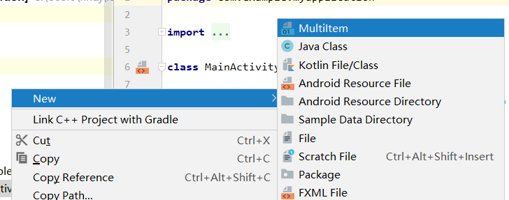
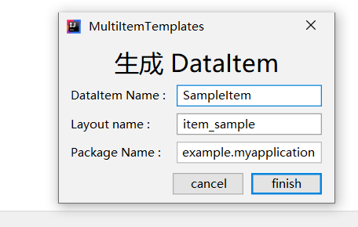
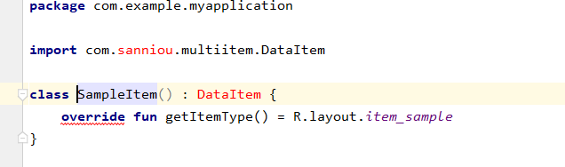
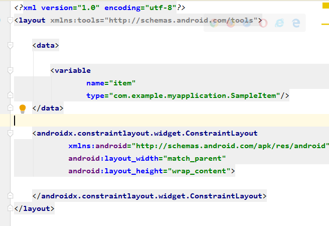

A plugin to build multiItemKit dataItem quickly 
# MultiItemTemplates 
intellij plugin  https://plugins.jetbrains.com/plugin/13622-multiitemtemplates
# MultiItemKit
A android util to build layout , binding data and view 
https://github.com/sanniou/MultiItemKit
# Usage
1.   create file  
    
1.   update Dialog  
    
1.   update DataItem  
    
1.   edit layout  
    
